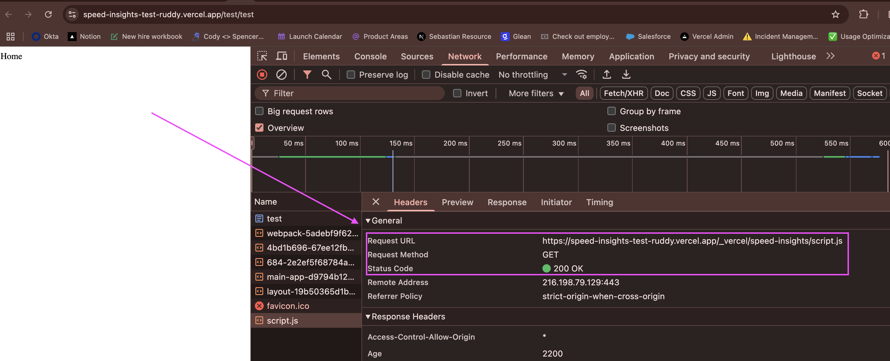

## Problem
The Speed Insights script is not found - a 404 is thrown when it is requested.

## Important Details
No top-level `layout.tsx` exists. The file structure being used is closer to the one I have created here: 

```
src
├── app
│   └── [territory]
│       └── [locale]
│           ├── (account)
│           │   └── account
│           │       └── page.tsx
│           ├── (default)
│           │   └── home
│           │       └── page.tsx
│           └── layout.tsx
└── middleware.ts
```

The Speed Insights component is being loaded into `src/app/[territory]/[locale]/layout.tsx`. In my own testing, I have not found a functional problem with this. The script loads just fine for me.

When the homepage is accessed, there is an immediate redirect in middleware from `/` to `/[territory]/[locale]`. This might be creating an issue due to the increased complexity of the production application, but it doesn't cause an issue for me.

## Debugging
This repo is an attempt at reproducing the issue, but despite trying many different possible implementations, the Speed Insight script loads for me every time. I've made adjustments to the file structure and to middleware, and have tried loading Speed Insights in other ways. Nothing creates a situation where a 404 is returned for the Speed Insights script on my end.


